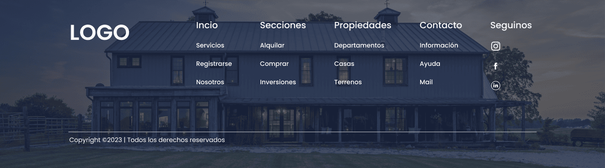

# Inmobiliaria Logo - Plataforma Digital Inmobiliaria

<div style="font-family: 'Poppins', sans-serif; font-size: 2.5em; font-weight: 600; text-align: center; margin: 20px 0;">
  LOGO
</div>

## 🏠 Descripción del Proyecto

Inmobiliaria Logo es una plataforma digital moderna y elegante diseñada para transformar la experiencia de búsqueda y gestión de propiedades. Esta aplicación web, desarrollada con las últimas tecnologías, ofrece una interfaz intuitiva y atractiva que conecta a usuarios con sus propiedades ideales.

### ✨ Características Principales

- **Búsqueda Inteligente**: Filtros avanzados para encontrar propiedades por ubicación, tipo, precio y características
- **Galería Visual**: Presentación elegante de propiedades con imágenes de alta calidad
- **Experiencia de Usuario**: Interfaz intuitiva y responsive para todos los dispositivos
- **Autenticación Segura**: Sistema de login integrado para usuarios registrados

## 🛠️ Tecnologías Implementadas

- **Frontend**: Angular 19
- **Estilos**: SCSS con diseño responsive
- **Control de Versiones**: Git & GitHub
- **Despliegue**: Netlify Pages

## 🚀 Demo en Vivo

Accede a la demo del proyecto: [Inmobiliaria Logo Demo](https://inmobiliaria-logo-tobias-moreno-techf.netlify.app/)

## 📱 Capturas de Pantalla

<div style="display: flex; flex-direction: column; gap: 20px; align-items: center;">
  
  
  
</div>

## 💻 Instalación Local

1. **Clonar el repositorio**

   ```bash
   git clone https://github.com/TobiasEmilianoMoreno/logo-frontend.git
   cd logo-frontend
   ```

2. **Instalar dependencias**

   ```bash
   npm install
   ```

3. **Iniciar el servidor de desarrollo**

   ```bash
   ng serve
   ```

4. **Acceder a la aplicación**
   ```
   http://localhost:4200
   ```

## 📋 Estructura del Proyecto

```
public/
├── assets/
│   └──images/
src/
├── app/
│   ├── components/
│   │   ├── hero/
│   │   ├── search-bar/
│   │   ├── property-cards/
│   │   ├── carousel/
│   │   ├── benefits/
│   │   ├── investment/
│   │   ├── footer/
│   │   └── auth/
│   ├── services/
│   ├── models/
│   └── shared/

```

---

Desarrollado por Tobias Emiliano Moreno 2025.
